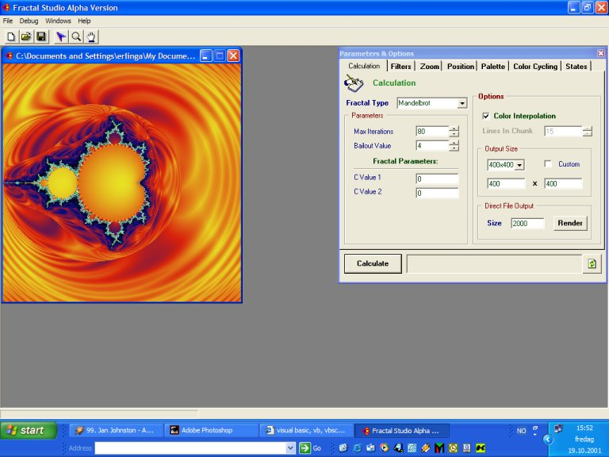



## Fractal Studio 0\.17a

### Description

Fractal Studio is a fractal generator. It generates nice pictures using mathematical formulae and different filters.

If you don't know what a fractal is, there's plenty of information on the net. A simple search should return lots of tutorials.

Please notice:

This is an alpha version, and is likely to contain some (probably a lot of) bugs/features.

There's still a lot to be implemented, I only submit this at this point to get some feedback.

If you have any suggestions as to how I could improve the user interface, feel free to mail me at erlinga@stud.ntnu.no. I'd appreciate it.

Bug reports can be sent to the above adress, too.

There's a readme-file included in the zip that I suggest you read - I'm afraid the user interface isn't very intuitive yet.

---

Hope you enjoy exploring the fractals!

Erling
 
### More Info
 
The required Win32 type library is included in the zip.

             |
---                |---
**Submitted On**   |2001-10-19 12:33:28
**By**             |[Erling Andersen](https://github.com/Planet-Source-Code/PSCIndex/blob/master/ByAuthor/erling-andersen.md)
**Level**          |Advanced
**User Rating**    |5.0 (124 globes from 25 users)
**Compatibility**  |VB 5\.0, VB 6\.0
**Category**       |[Graphics](https://github.com/Planet-Source-Code/PSCIndex/blob/master/ByCategory/graphics__1-46.md)
**World**          |[Visual Basic](https://github.com/Planet-Source-Code/PSCIndex/blob/master/ByWorld/visual-basic.md)
**Archive File**   |[Fractal St3000310202001\.zip](https://github.com/Planet-Source-Code/erling-andersen-fractal-studio-0-17a__1-28267/archive/master.zip)

